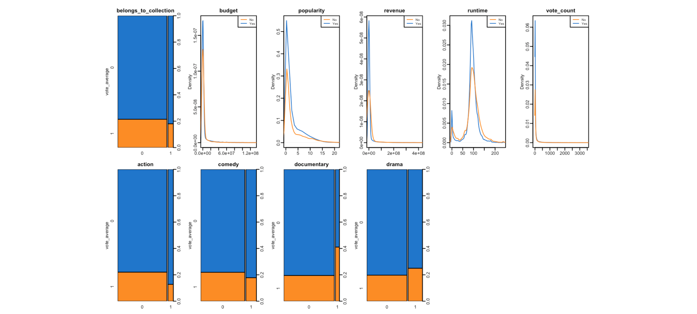

# Predicting average movie ranking using Machine Learning

- [Business Understanding](#business-understanding)
- [The Dataset](#dataset)
  - [Issues with the data](#issues-with-the-data)
  - [Processing the data](#processing-the-data)
  - [Final dataset](#final-dataset)
  - [Descriptive statistics](#descriptive-statistics)
  - [Preparation of training and test sample for modelling](#preparation-of-training-and-test-sample-for-modelling)
- [Evaluation of different models](#evaluation-of-different-models)
  - [k Nearest Neighbor Model](#k-nearest-neighbor-model)
  - [Naive Bayes Model](#naive-bayes-model)
  - [Logistic Regression Model](#logistic-regression-model)
  - [Stepwise Logistic Regression Model](#stepwise-logistic-regression-model)
  - [Classification Tree Model](#classification-tree-model)
  - [Random Forests Model](#random-forests-model)
  - [Importance of variables for different models](#importance-of-variables-for-different-models)
- [Evaluation of results](#evaluation-of-results)
- [Final model evaluation](#final-model-evaluation)
- [Concluding remarks](#concluding-remarks)
- [Notes](#notes)
- [Authors](#authors)

## Business Understanding

We focus primarily on inference, however, our project will provide information which can be later on interpreted for different interest groups. As an example, an average movie viewer might want to look at our data to find out which film to watch when going to the cinema or download at home. Television channels can use it to decide which movies to put on air to attract viewers. A cinema chain could look into it and decide whether it is worth to buy the streaming rights for a particular movie. Production companies can determine how much money it would be appropriate to spend on an in-the-making movie based on our findings. In most of these cases, it is more advantageous to use precision in classification, as thanks to the high number of entries in the data set it would be less costly classifying some good films as negative, rather than having bad movies classified as good ones.

## Dataset

The data is almost perfectly complete, except movies which were not actually released (rumored, in production etc.) or some entries which were invalid.
We obtained the dataset from [kaggle](https://www.kaggle.com/rounakbanik/the-movies-dataset). The dataset contains information on 45,000 movies which were released on or before July 2017. It was created by GroupLens. 
In order to obtain better results, we have tweaked the vote average so that it is a binary variable; if the rating is above 4 the value will be true otherwise it will be false. We also transformed the respective variables into the appropriate format. Another tweak we made is that we are interested in the main genre of the movie, so only the one which describes it the most. For this we disregarded the secondary genre categorization given to the movies. We also disregarded the entries which were not valid.

### Issues with the data

As we can see from the output above, many variables are just different ids or provide some additional but not important information about the movies and they will have to be omitted for the purpose of further analysis. For the variables which we are going to keep, almost all of them have incorrect types and have to transformed to either factors or numeric types which we have to deal with in the next step. Moreover, we noticed that there are many missing values for some of the variables which prevents us from including them into our models.

### Processing the data

For processing of the data, we need to transform the variables we are going to keep into correct types. For the response variable, we decided to split movies' ranking averages into negative (between 0-7) and positive (between 7-10). When it comes to belongs_to_collection variable, we decided to convert into categorical (binary) variable. Moreover, we decided to create new factor variables for the four most frequent genres to see whether they have an impact on movies being ranked positively. Furthermore, we decided to exclude variables which describe the movies' language, country, title, adult ranking, etc. as usually they would have too many factors and they were not suitable for our analysis.

```r
bad_data_index <- which(movies$adult != 'TRUE' & movies$adult != 'FALSE')
movies <- movies[-c(bad_data_index),]

movies <- movies[,-c(1,4,6,7,8,9,10,11,13,14,15,16,17,18,21,22,23,24,25,26)]

movies <- na.exclude(movies)

movies$belongs_to_collection[movies$belongs_to_collection == ''] <- 0
movies$belongs_to_collection[movies$belongs_to_collection != 0] <- 1
movies <- transform(movies,belongs_to_collection = factor(belongs_to_collection, 
                                                          levels = c(0, 1), labels = c(0, 1)))

movies$budget[movies$budget==""] <- NA
movies$budget <- as.numeric(movies$budget)

movies$action <- 0
movies$action[movies$genres_adj=="Action"] <- 1
movies$action <- factor(movies$action)

movies$comedy <- 0
movies$comedy[movies$genres_adj=="Comedy"] <- 1
movies$comedy <- factor(movies$comedy)

movies$documentary <- 0
movies$documentary[movies$genres_adj=="Documentary"] <- 1
movies$documentary <- factor(movies$documentary)

movies$drama <- 0
movies$drama[movies$genres_adj=="Drama"] <- 1
movies$drama <- factor(movies$drama)

movies <- movies[,-c(3)]

movies$popularity <- as.numeric(movies$popularity)

movies$vote_average[movies$vote_average >= 7] <- "pos"
movies$vote_average[movies$vote_average < 7] <- 0
movies$vote_average[movies$vote_average == "pos"] <- 1
movies <- transform(movies,vote_average = factor(vote_average, levels = c(0, 1),
                                                 labels = c(0, 1)))

movies <- na.exclude(movies)
```

### Final dataset 

* `Budget`: how much money did the movie cost to produce (USD) 
* `Belong to collection`: whether the movie is a part of a series of connected movies
* `Revenue`: how much money did it make (USD)  
* `Popularity`: the movies ticket sales while in cinemas (first screening) (USD)
* `Runtime`: how long it is(minutes)  
* `Vote average`: whether the movie has an IMDB score of 7 and above, or below 7
* `Vote count`: how many people rated it on IMDB  
* `Drama` : whether or not the movie is a drama
* `Documentary` : whether or not the movie is a documentary
* `Comedy` : whether or not the movie is a comedy
* `Action` : whether or not the movie is an action movie

### Descriptive statistics


From the summary of the variables we can see that the variables belongs to collection, vote average, action, comedy, documentary and drama are all categorical variables with levels 0 and 1 (representing no and yes respectively). The budget variable has a huge negative skew, due to most movies not being Hollywood blockbusters that have huge budgets, but rather independent movies with small funding. Therefore there is a median of 0 and a small mean compared to the maximum value. With the popularity, revenue and vote count variables we can see the same effect, just less extreme and that in the disparity between Hollywood movies and independent movies, and how Hollywood movies (or other high budget films) represent only a small portion of the dataset. With runtime we can see that the values are as we would expect them to be, with an average of 95 minutes; however there is a huge outlier with a movie that is 1256 minutes long.

From the histograms of the different variables we can see that the dataset is unbalanced for most of the variables; we can see that for belongs to collection and vote average the relationship is approximately 4:1, meaning that for every 4 movies that do not belong to a collection, or that do not have a rating of 7 or higher, there is one that does. The variables action, comedy, documentary and drama, have approximately the same relationship, however as these are mutually exclusive in our case, this is not an issue for the dataset.For the variables budget, popularity, revenue, runtime and vote_count we can see that the data is skewed leftwards severely, and that there are just a few outliers.



From the graphs, we can deduce that the impact of the variables on whether vote average is going to be 0 or 1 is not really visible. We can see that movies with a higher revenue as well as an average runtime will preform better, however the effect does not seem to be significant.

### Preparation of training and test sample for modelling 

First of all, we need to scale the numeric variables as some of the models are sensitive to how large the distance between the observations is. Furthermore, We decided to make a random sample from the movies dataset in order to build the training dataset which has 50% of the observations and the rest of the observations goes to the test dataset to test the models on unseen data by the different models.

```r
set.seed(2000)

`%notin%` <- Negate(`%in%`)
for (i in 1:varCount) {
  if (i %notin% factor_index) {
    movies[[i]] <- scale(movies[[i]])
  }
}

random_index <- sample(1:nrow(movies), floor(0.5*nrow(movies)))
train <- movies[random_index, ]
test <- movies[-random_index, ]
```

## Evaluation of different models

For evaluating which variable has an impact on positive movie ratings, we use k Nearest Neighbour model, Naive Bayes model, Logistic Regression model, Stepwise Logistic Regression model, Classification Tree model and Random Forests model to see which one performs the best by looking at the accuracy, recall and precision values of the different models. We also tried to use Linear and Radial Support Vector Machine models, however, the models take a lot of computational power due to the big amount of observations and variables in the training data.

### k Nearest Neighbor Model

The k Nearest neighbor classifier classifies the rankings as positive or negative based o the Euclidean distance of the labeled observations to another observation. Based on the distance, the class label of k nearest observations is used to determine class neighbours of the unknown record. For this method, the choice of k is crucial (usually between 1 and 20) as it determines the flexibility of the classification. For using this method, we need to scale the model as it is sensitive to the difference of magnitude of other variables due to the distance measure used for classifying the observations. The advantage of this model is that it can handle easily the interaction between different variables as the decisions are made based on local information. However, the disadvantage is that the model does not handle well redundant variables present in the model.

```r
fitControl <- trainControl(method = "cv", number = 5)

k <- c(1:20)
knn_train <- train(vote_average ~ ., data = train, method = "knn", trControl = fitControl, tuneGrid = data.frame(k = k))
print(knn_train )
```
```
k-Nearest Neighbors 

22595 samples
   10 predictor
    2 classes: '0', '1' 

No pre-processing
Resampling: Cross-Validated (5 fold) 
Summary of sample sizes: 18076, 18076, 18077, 18076, 18075 
Resampling results across tuning parameters:

  k   Accuracy   Kappa    
   1  0.7138306  0.1385354
   2  0.7123696  0.1334210
   3  0.7548132  0.1629021
   4  0.7560080  0.1572541
   5  0.7730033  0.1636734
   6  0.7741540  0.1677848
   7  0.7831822  0.1681041
   8  0.7823415  0.1672104
   9  0.7885819  0.1665875
  10  0.7892900  0.1703873
  11  0.7911488  0.1618586
  12  0.7922554  0.1644643
  13  0.7939371  0.1602126
  14  0.7944240  0.1612642
  15  0.7960172  0.1612216
  16  0.7949553  0.1544346
  17  0.7961501  0.1557381
  18  0.7969025  0.1542708
  19  0.7971680  0.1508562
  20  0.7963713  0.1487854

Accuracy was used to select the optimal model using the largest value.
The final value used for the model was k = 19.
As we can see from the output above, the final model has used 19 nearest neighbours to classify the movie rankings into positive and negative.
```

### Naive Bayes Model

Naive Bayes classifier is a probabilistic framework for solving classification problems using conditional probabilities. Given the class, the model works under the assumption that the variables are independent from one another which is called conditional independence. The Naive Bayes model can be quite robust to isolated noise points as well as irrelevant attributes.

```r
nb_train <- train(vote_average ~ ., data = train, method = "naive_bayes", trControl = fitControl)
print(nb_train)
```
```
Naive Bayes 

22595 samples
   10 predictor
    2 classes: '0', '1' 

No pre-processing
Resampling: Cross-Validated (5 fold) 
Summary of sample sizes: 18076, 18076, 18076, 18077, 18075 
Resampling results across tuning parameters:

  usekernel  Accuracy   Kappa     
  FALSE      0.7650364  0.16048348
   TRUE      0.7902191  0.03033125

Tuning parameter 'laplace' was held constant at a value of 0
Tuning parameter 'adjust' was held constant at
 a value of 1
Accuracy was used to select the optimal model using the largest value.
The final values used for the model were laplace = 0, usekernel = TRUE and adjust = 1.
```

### Logistic Regression Model

Logistic Regression is used to describe the relationship between a binary outcome and other independent variable using log-odds to predict the probability of a movie having a positive ranking. For estimating the coefficients (the log-odds) of the model Maximum Likelihood Estimation is used to find the probabilities. The advantages of the model are that it gives us a good idea of how important a certain regressor is and it is also less affected by outliers than, for instance, the linear probability model. The downside of the model is that it assumes linearity between dependent and independent variables, and also that it is very difficult to predict multivariate relationships with a big number of regressors using the logistic regression model.

```r
glm_train <- train(vote_average ~ ., data = train, trControl = fitControl, method = "glm")
summary(glm_train)
```
```
Call:
NULL

Deviance Residuals: 
    Min       1Q   Median       3Q      Max  
-3.3803  -0.6979  -0.6101  -0.4724   2.9485  

Coefficients:
                       Estimate Std. Error z value Pr(>|z|)    
(Intercept)            -1.52949    0.03044 -50.246  < 2e-16 ***
belongs_to_collection1 -0.19241    0.06511  -2.955  0.00312 ** 
budget                 -0.53089    0.04309 -12.321  < 2e-16 ***
popularity              0.08508    0.03184   2.672  0.00755 ** 
revenue                -0.06543    0.04025  -1.625  0.10408    
runtime                 0.17990    0.01808   9.951  < 2e-16 ***
vote_count              0.69656    0.04737  14.704  < 2e-16 ***
action1                -0.40100    0.07164  -5.598 2.17e-08 ***
comedy1                 0.03377    0.04930   0.685  0.49336    
documentary1            1.24261    0.05868  21.178  < 2e-16 ***
drama1                  0.37017    0.04295   8.619  < 2e-16 ***
---
Signif. codes:  0 ‘***’ 0.001 ‘**’ 0.01 ‘*’ 0.05 ‘.’ 0.1 ‘ ’ 1

(Dispersion parameter for binomial family taken to be 1)

    Null deviance: 23302  on 22594  degrees of freedom
Residual deviance: 21993  on 22584  degrees of freedom
AIC: 22015

Number of Fisher Scoring iterations: 5
```

### Stepwise Logistic Regression Model

The Stepwise Logistic Regression Model builds on the Logistic Regression, and deals with potential redundant variables in the model by calculating the AIC score of the model with or without different variables in order to determine which model is the optimal one with the least amount of redundant variables. The advantage of this model is that we can determine which variables are significant and we can get rid of redundant ones that might be messing up our predictions, however as with the logistic regression it assumes linearity between dependent and independent variables, and also that it is very difficult to predict multivariate relationships with a big number of regressors using the logistic regression model.

```r
s_glm_train <- train(vote_average ~ ., data = train, trControl = fitControl, method = "glmStepAIC")
```
```
Call:
NULL

Deviance Residuals: 
    Min       1Q   Median       3Q      Max  
-3.3788  -0.6977  -0.6105  -0.4724   2.9450  

Coefficients:
                       Estimate Std. Error z value Pr(>|z|)    
(Intercept)            -1.51745    0.02477 -61.271  < 2e-16 ***
belongs_to_collection1 -0.19341    0.06510  -2.971  0.00297 ** 
budget                 -0.53116    0.04308 -12.330  < 2e-16 ***
popularity              0.08563    0.03185   2.689  0.00717 ** 
revenue                -0.06510    0.04025  -1.617  0.10579    
runtime                 0.17977    0.01807   9.948  < 2e-16 ***
vote_count              0.69584    0.04735  14.695  < 2e-16 ***
action1                -0.41280    0.06950  -5.939 2.86e-09 ***
documentary1            1.23060    0.05595  21.994  < 2e-16 ***
drama1                  0.35816    0.03915   9.148  < 2e-16 ***
---
Signif. codes:  0 ‘***’ 0.001 ‘**’ 0.01 ‘*’ 0.05 ‘.’ 0.1 ‘ ’ 1

(Dispersion parameter for binomial family taken to be 1)

    Null deviance: 23302  on 22594  degrees of freedom
Residual deviance: 21994  on 22585  degrees of freedom
AIC: 22014

Number of Fisher Scoring iterations: 5
```

### Classification Tree Model

Classification trees are used for stratifying predictors into a number of simple shapes (typically high-dimensional rectangles or boxes). The trees use a certain amount of splits to decide on boundaries for the shapes to be drawn. When we do not control for the amount of splits or how large the tree should grow, usually the model results in overfitting the data and it becomes difficult to interpret. Hence, we use pruning (cp value) to control for how large the tree should grow to minimize the X relative error which measures the error rate of predictions made by the model on the unseen data with the cost of introducing a little bias. A great advantage of using trees for classification is that they are easy to interpret and they can be used easily for making decisions just by simply following the yes or no branches. However, usually they do not have as big of predictive accuracy as other classification techniques.

Firstly, we start with a full tree with no pruning.

```r
rpart_train_full <- rpart(vote_average ~ ., data = train, control = list(cp = 0))
rsq.rpart(rpart_train_full)
```
```
Classification tree:
rpart(formula = vote_average ~ ., data = train, control = list(cp = 0))

Variables actually used in tree construction:
 [1] action                belongs_to_collection budget                comedy               
 [5] documentary           drama                 popularity            revenue              
 [9] runtime               vote_count           

Root node error: 4774/22595 = 0.21129

n= 22595 

           CP nsplit rel error  xerror     xstd
1  5.9000e-03      0   1.00000 1.00000 0.012853
2  5.4462e-03      6   0.96460 0.97801 0.012749
3  4.0846e-03      9   0.94784 0.97026 0.012711
4  1.9899e-03     11   0.93967 0.95957 0.012659
5  1.6757e-03     13   0.93569 0.95894 0.012656
6  1.3615e-03     16   0.93067 0.95559 0.012639
7  1.2568e-03     18   0.92794 0.95287 0.012626
8  1.1870e-03     23   0.92166 0.95287 0.012626
9  1.1521e-03     26   0.91810 0.95287 0.012626
10 1.0997e-03     29   0.91433 0.95287 0.012626
11 1.0473e-03     34   0.90867 0.95266 0.012625
12 9.7752e-04     38   0.90448 0.94826 0.012603
13 8.3787e-04     41   0.90155 0.94805 0.012602
14 7.3314e-04     48   0.89548 0.94638 0.012594
15 6.9823e-04     54   0.89108 0.94742 0.012599
16 6.2840e-04     58   0.88814 0.94889 0.012606
17 5.2367e-04     94   0.86112 0.95622 0.012642
18 5.0272e-04    100   0.85798 0.96020 0.012662
19 4.8876e-04    109   0.85274 0.96020 0.012662
20 4.1894e-04    133   0.83661 0.96837 0.012702
21 3.7704e-04    174   0.81881 0.96900 0.012705
22 3.4911e-04    179   0.81693 0.97717 0.012745
23 3.3515e-04    197   0.80834 0.98052 0.012761
24 3.1420e-04    212   0.80163 0.98178 0.012767
25 2.7929e-04    243   0.79074 0.98890 0.012801
26 2.5136e-04    266   0.78383 0.99874 0.012848
27 2.0947e-04    271   0.78257 1.03310 0.013006
28 1.9043e-04    368   0.76037 1.03603 0.013020
29 1.8619e-04    379   0.75827 1.04231 0.013048
30 1.7456e-04    403   0.75304 1.04839 0.013075
31 1.5710e-04    413   0.75052 1.06033 0.013128
32 1.4962e-04    443   0.74529 1.06787 0.013161
33 1.3965e-04    450   0.74424 1.06850 0.013164
34 1.3092e-04    465   0.74214 1.07080 0.013174
35 1.2568e-04    473   0.74110 1.07310 0.013184
36 1.0473e-04    478   0.74047 1.09154 0.013263
37 8.9772e-05    520   0.73607 1.09363 0.013272
38 6.9823e-05    555   0.73230 1.09782 0.013290
39 5.2367e-05    582   0.73021 1.10662 0.013327
40 4.6548e-05    602   0.72916 1.11395 0.013357
41 4.1894e-05    611   0.72874 1.11542 0.013363
42 3.4911e-05    637   0.72748 1.11709 0.013370
43 2.9924e-05    649   0.72706 1.11814 0.013375
44 2.3274e-05    656   0.72685 1.11856 0.013376
45 2.2049e-05    674   0.72643 1.12128 0.013388
46 0.0000e+00    693   0.72602 1.12170 0.013389
```

R−square | X Relative Error
--- | ---
 | 

Based on results given by the full tree, we can see that X Relative Error minimized with the first couple of splits and it rises with the increasing number of splits. Hence,  we choose the cp value of 0.0054462 which uses 6 splits.

```r
rpart_train_prunned <- prune(rpart_train_full, cp = 5.4462e-03 )
rpart.plot(rpart_train_prunned)
```


We implement the pruned tree with the caret package so we can compare the model more easily with other models.

```r
rpart_train <- train(vote_average ~ ., data = train, method = "rpart", cp = 5.4462e-03, trControl = fitControl)
```

### Random Forests Model

The Random Forests model provides an alternative to the decision tree, that reduces the variance of the predictions by constructing bootstrapped training samples. The advantage of this model is that it is less prone to overfitting than the Decision Tree model, however the computations made by the model can be quite complex and take a lot of computational power.

```r
rf_train <- train(vote_average ~ ., data = train, method = "rf", tuneGrid = data.frame(mtry = 3), trControl = fitControl)
print(rf_train)
```
```
Random Forest 

22595 samples
   10 predictor
    2 classes: '0', '1' 

No pre-processing
Resampling: Cross-Validated (5 fold) 
Summary of sample sizes: 18076, 18077, 18076, 18076, 18075 
Resampling results:

  Accuracy   Kappa    
  0.8016817  0.1558033

Tuning parameter 'mtry' was held constant at a value of 3
```

### Importance of variables for different models

k Nearest Neighbor Model:  

variable | Importance
--- | ---
runtime | 100.000000			
documentary | 80.100734			
vote_count | 75.560168			
drama | 48.055287			
action | 35.616397			
comedy | 21.704528			
popularity | 18.145106			
revenue | 6.046431			
belongs_to_collection | 2.063570			
budget | 0.000000	

Naive Bayes Model:

variable | Importance
--- | ---
runtime | 100.000000			
documentary | 80.100734			
vote_count | 75.560168			
drama | 48.055287			
action | 35.616397			
comedy | 21.704528			
popularity | 18.145106			
revenue | 6.046431			
belongs_to_collection | 2.063570			
budget | 0.000000	

Logistic Regression Model:  

variable | Importance
--- | ---
documentary1 | 100.000000			
vote_count | 68.411177			
budget | 56.783289			
runtime | 45.215757			
drama1 | 38.714564			
action1 | 23.972273			
belongs_to_collection1 | 11.078485			
popularity | 9.694992			
revenue | 4.588986			
comedy1 | 0.000000	

Stepwise Logistic Regression Model:  

variable | Importance
--- | ---
runtime | 100.000000			
documentary | 80.100734			
vote_count | 75.560168			
drama | 48.055287			
action | 35.616397			
comedy | 21.704528			
popularity | 18.145106			
revenue | 6.046431			
belongs_to_collection | 2.063570			
budget | 0.000000	

Classification Tree Model:  

variable | Importance
--- | ---
vote_count | 100.0000000			
runtime | 81.0378208			
popularity | 49.5555514			
documentary1 | 31.9196107			
budget | 21.4742073			
revenue | 15.0762649			
drama1 | 13.3703522			
action1 | 8.4721905			
belongs_to_collection1 | 0.1251383			
comedy1 | 0.0000000	

Random Forest Model:

variable | Importance
--- | ---
popularity | 100.000000			
vote_count | 88.626892			
runtime | 84.290624			
budget | 27.272867			
revenue | 20.004509			
documentary1 | 13.283619			
drama1 | 2.804445			
belongs_to_collection1 | 2.231771			
comedy1 | 1.662754			
action1 | 0.000000	

When we compare the vairable importance for the different models, we can see that for most of the models there are vairables which seem to be "the most important". These variables are: runtime, vote count, documentary, drama and runtime. The knn model and the Naive Bayes model identify the same vairables to be the most important: runtime, documentary, vote count and drama. When we look at the glm and the stepwise output, its the same 4 variables just that the order they are in is different; the glm model identifies the variable documentary to be the most important, while for the stepwise model it would be the variable runtime. For the classification tree model, the most important variable is vote count, then runtime, popularity and lastly documentary. For the random forest model the most important variables are popularity, vote count, runtime and budget in that order.
From this we can conclude that runtime seems to be an important factor to whether a movie will score well or not. This could be due to the number of outliers that are too long or too short to be feature length. The variable vote count could make sense, if we take into account that potentially movies with less reviews would have bettter reviews, or that really good movies would have the highest amount of reviews (such as classic movies). Documentary and drama could be identified as the two genres that are most popular with the audience, or that have the best quality movies classified as them.

## Evaluation of results

Model | Accuracy | Recall | Precision
--- | --- | --- | ---
k Nearest Neighbor Model | 79.58 | 97.27 | 80.76
Naive Bayes Model | 78.96 | 99.49 | 79.17
Logistic Regression Model | 79.47 | 99.41 | 79.62
Stepwise Logistic Regression Model | 79.47 | 99.41 | 79.62
Classification Tree Model | 79.63 | 98.65 | 80.12
Random Forest Model | 80.38 | 98.18 | 80.98

When we look at the performance of the different models, we can see that they all perform well in the recall metric. The best preforming model in this metric is the Nayve Bayes model, which has a 99.49 percent recall value. The accuracy metric sits around 79 percent for all the models, apart from the Random forest model, which preforms the best in this metric (just one percent higher than the others). For the precision metric all the models seem to have the same performance around 79-80 percent. For this metric the Random Forest model again has the best performance again, which has precision metric of 80.98 percent.
For our research cause, which would be movie recommendations, we would prefer not to have people waste their time on movies which they will not like, therefore it is important to maximize the precision metric which minimizes the false positives in the model. Based on that, we choose the Random Forest model, which seems to be the best suited for our cause, and we will reflect on it in the final model evaluations.

## Final model evaluation  

The most important variables for the random forest model are popularity, vote count and budget. Judging by this, the best metric to determine whether a movie will have an IMDB rating of above 7 is popularity. As it was defined in the beginning of the dataset, popularity represents the ticket sales in the opening week when the movie was in cinemas. This metric can definitely be useful in determining whether a movie will be well received and whether in general it will be a good movie, however there are still exceptions to this rule like for example the movie Shawshank Redemption, which did not even break even from the ticket sales for opening week, however as of today it is the highest rated movie on IMDB. For this the variable vote count can definitely come useful, as mentioned before movies with a low amount of ratings can have a substantially higher score than those with more, as with a smaller amount of reviews, the reviews will probably be only from people who have a bias towards the movie (that were in some way involved in the production). However, this effect also works the other way, a high amount of votes would also represent that a lot of people have strong feeling about it, and liked the movie enough to leave a review for it. Budget can be easily explained, as in general higher budget movies will have a broader audience than independent or even low budget movies.

## Concluding remarks

This model seems to preform well, and we can use it for further research on the topic and further evaluations. Considerations which we can take into account moving along, would be finding a computer with higher computational power, so that we can preform the model with more variables (for example more genres than just the three we could implement) as well as potentially employing a higher training dataset to see whether the performance metrics could be increased. Another implementation we could consider is only considering movies that have a certain number of reviews, so that we can not have outliers mentioned above, where movies with a low number of ratings will end up preforming well.

## Notes
The dataset included in this repository does not contain all the ~45K rows, but only 30K rows due to the size of the file. Hence, the models might look different with the dataset included in this repository. The original dataset can be obtained from [kaggle](https://www.kaggle.com/rounakbanik/the-movies-dataset).

## Authors
Ema Vargova, Luka Corsovic, Marcell Molnár

